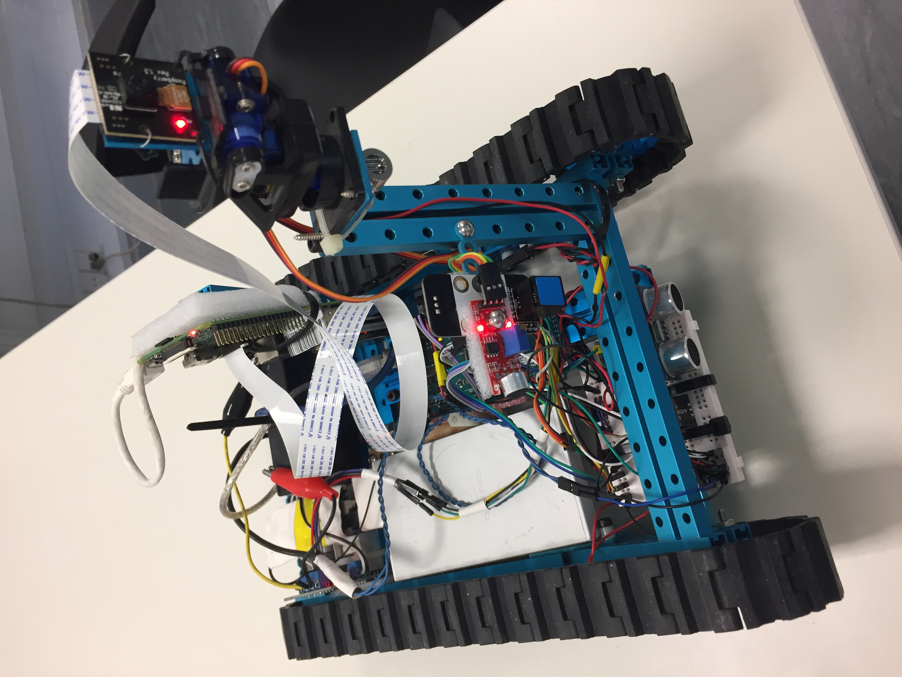
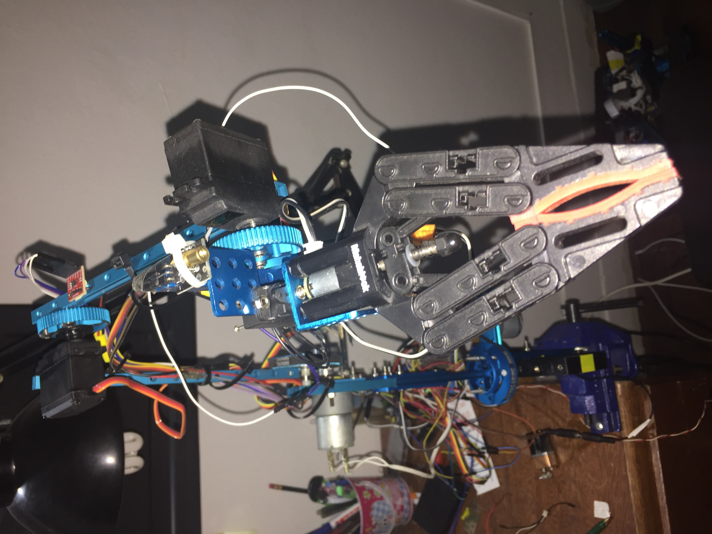

# ShinkeyBot

Shinkeybot is a cognitive computing robot and testbed platform for robotics and STEM.

# Library:
* http://www.ladyada.net/learn/arduino/lesson5.html
* http://www.instructables.com/id/Arduino-Button-Tutorial/
* http://www.forkrobotics.com/2013/06/using-the-gy80-10dof-module-with-arduino/
* http://blog.oscarliang.net/use-gy80-arduino-adxl345-accelerometer/
* http://www.arduinoecia.com.br/2014/09/sensor-gy-80-acelerometro-bussola-barometro.html
* http://www.forkrobotics.com/2013/06/using-the-gy80-10dof-module-with-arduino/
* https://github.com/Anilm3/ADXL345-Accelerometer
* http://blog.oscarliang.net/use-gy80-arduino-adxl345-accelerometer/

# Sensors
* gy80 sensor, vccin 5v, gnd-gnd, scl a5, sda a4  

# USB-powered
* http://www.startech.com/faq/usb_hubs_industrial_power_adapter

# Features

* Realtime telemetry.
* Autodiscovery with multicast signal.
* Remote controlling mode via UDP.
* Real-time H264 streaming to iPhone app or to whatever you want.
* Isolated power source.

# Motor Unit Arm

* The arm, motorunit controlled, is now a 6th dof 0.5 kg payload arm.  Works quite good.
* Homing.

# To DO
* Reset and calibrate the clavicle with a button sensor.
* Power Consumption from USB hub.
  * Adding the current sensor and voltage sensor for the batteries.
  * Integrate everything into a power source
  * Find a good 12 V high power battery.
* Force Sensor for gripper.
* Hook up the robot to the brain signals.

# Benchmarks
* Follow the gripper's laser with the pan-and-tilt camera.
* Autohook to battery charger (feeding benchmark).
* Follow light and sound sources.
* Perform basic SLAM

# References
* http://www.johnboucha.com/arduino-photoresistor/
* https://gist.github.com/tagliati
* https://tkkrlab.nl/wiki/Arduino_KY-012_Active_buzzer_module
* https://learn.adafruit.com/adafruit-arduino-lesson-3-rgb-leds/breadboard-layout
* https://learn.sparkfun.com/tutorials/ir-control-kit-hookup-guide?_ga=1.8013874.1081308802.1469763161
