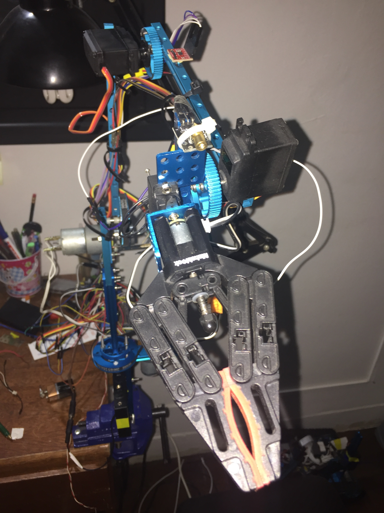

# HoloBot

HoloBot is an holonomic 4-wheel robot version of ShinkeyBot

# Library:

# Sensors

# USB-powered
* http://www.startech.com/faq/usb_hubs_industrial_power_adapter

# Features

* Realtime telemetry.
* Autodiscovery with multicast signal.
* Remote controlling mode via UDP.
* Real-time H264 streaming to iPhone app or to whatever you want.
* Isolated power source.

# Motor Unit Arm

* The arm, motorunit controlled, is now a 6th dof 0.5 kg payload arm.  Works quite good.
* Homing.

# To DO

# Benchmarks

# References
